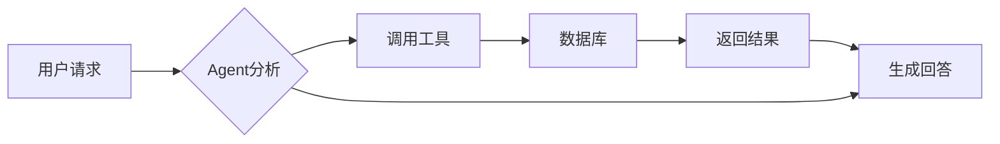
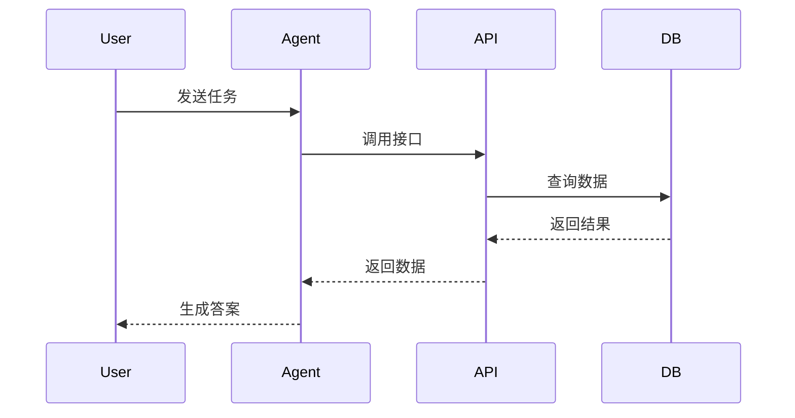
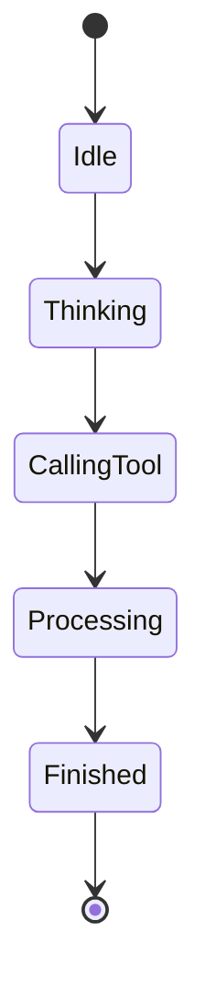
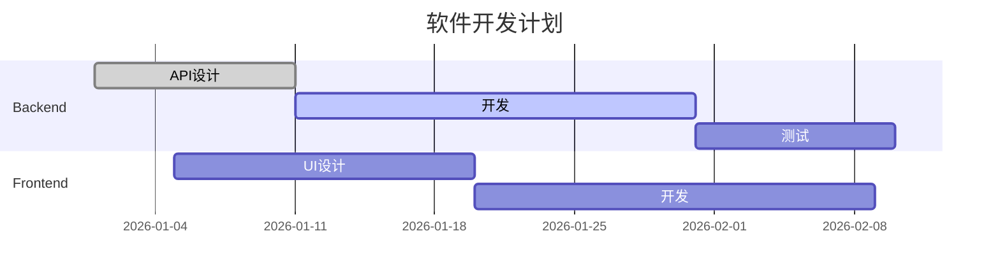

# [Markdown 渲染器极限压力测试文档](https://github.com/wifi504/easy-markstream/blob/main/playground/public/test-cases/markdown/markdown-renderer-stress-test.md)

👆甚至第一行是个链接

> 本文用于测试 Markdown 解析器、AST 渲染器、富文本编辑器、聊天窗口 Markdown 渲染组件的极限能力。

测试目标：

- 多级标题解析
- 超长文本渲染
- 表格布局
- 复杂列表嵌套
- 引用嵌套
- 数学公式渲染
- 代码高亮
- Diff 代码对比
- Mermaid 图表
- HTML 混合
- 脚注
- 任务列表
- 引用式链接
- Emoji
- 特殊字符
- 转义字符
- 多语言混排
- 大量节点渲染性能

---

# 1. Markdown 基础元素测试

## 1.1 标题层级

# 一级标题

## 二级标题

### 三级标题

#### 四级标题

##### 五级标题

###### 六级标题

---

# 2. 文本格式测试

普通文本。

**粗体文本**

*斜体文本*

***粗斜体文本***

~~删除线文本~~

上标：x^2^

下标：H~2~O

组合：

**这是粗体中的 \*斜体\***

***这是粗体斜体组合***

---

# 3. 引用块压力测试

> 第一层引用。
>
> > 第二层引用。
> >
> > > 第三层引用。
> >
> > 返回第二层。
>
> 返回第一层。

复杂引用：

> ## 引用中的标题
>
> 引用中包含列表：
>
> 1. 第一项
> 2. 第二项
> 3. 第三项
>
> 引用中包含代码：
>
> ```javascript
> console.log("Nested quote code");
> ```

---

# 4. 列表压力测试

## 无序列表

- 一级节点
  - 二级节点
    - 三级节点
      - 四级节点
        - 五级节点

## 有序列表

1. 第一阶段
   1. 第一阶段子任务
      1. 深层任务
         1. 最深层任务
2. 第二阶段
3. 第三阶段

## 混合列表

1. 系统设计
   - 后端架构
     - API设计
     - 数据库设计
   - 前端架构
     - Vue
     - React
2. 部署流程
   - Docker
   - Kubernetes

---

# 5. 表格渲染测试

## 普通表格

| 名称     | 类型 | 描述     |
| -------- | ---- | -------- |
| CPU      | 硬件 | 负责计算 |
| Memory   | 硬件 | 数据存储 |
| Database | 软件 | 数据管理 |

## 对齐测试

| 左对齐        | 居中          | 右对齐        |
| :------------ | :-----------: | ------------: |
| A             | B             | C             |
| Long Text     | Long Text     | Long Text     |

## 超宽表格

| ID   | Name    | Description  | Version | Status  | Owner | Created    | Updated    |
| ---- | ------- | ------------ | ------- | ------- | ----- | ---------- | ---------- |
| 001  | Agent   | 智能代理系统 | 1.0.0   | Running | Admin | 2026-01-01 | 2026-08-12 |
| 002  | Gateway | API网关      | 2.0.0   | Running | Root  | 2026-02-01 | 2026-08-12 |

---

# 6. 代码块测试

## JavaScript

```javascript
class Agent {

    constructor(name) {
        this.name = name;
        this.memory = [];
    }


    execute(task) {

        console.log(
            `${this.name} executing ${task}`
        );

        return true;
    }

}


const agent = new Agent("AI");

agent.execute("Analyze Data");
```

## TypeScript

```typescript
interface Message {

    id: string;

    role:
        | "user"
        | "assistant"
        | "system";

    content: string;

}


function sendMessage(
    message: Message
): Promise<void> {

    return Promise.resolve();

}
```

## Go

```go
package main

import "fmt"


type Agent struct {
    Name string
}


func (a Agent) Run(task string) {

    fmt.Println(
        a.Name,
        task,
    )

}


func main(){

    agent := Agent{
        Name:"GPT",
    }

    agent.Run(
        "testing",
    )

}
```

## Python

```python
from dataclasses import dataclass


@dataclass
class Agent:

    name: str

    def run(self, task):
        return {
            "agent": self.name,
            "task": task
        }


agent = Agent("AI")

print(
    agent.run("test")
)
```

## Java

但是有人写了非常长的一行

```java
public class HelloWorld {
    public static void main(String[] args) {
        System.out.println("Hello, World! This is a very long line of code designed to demonstrate what an extremely long Java statement looks like when someone writes unnecessarily verbose code: " + "Java is a powerful, object-oriented programming language that runs on the Java Virtual Machine (JVM), allowing developers to write once and run anywhere across different operating systems and hardware platforms, and this sentence keeps getting longer and longer just to make this single line ridiculously huge for testing editors, formatters, syntax highlighters, code wrapping behavior, horizontal scrolling performance, and IDE rendering capabilities. " + "The quick brown fox jumps over the lazy dog while the compiler patiently waits for the next token to arrive because this line contains an absurd amount of string concatenation that no professional developer would normally write in production code unless they were intentionally testing something.");
    }
}
```

## Diff

简易增删：

```diff
- const name = 'old'
+ const name = 'EasyMarkstream'
```

unified diff（含文件头与 hunk）：

```diff
--- a/src/greet.ts
+++ b/src/greet.ts
@@ -1,8 +1,11 @@
 export function greet(name: string) {
-  return 'hello ' + name
+  const message = `hello ${name}`
+  return message
 }

-export const VERSION = '0.0.1'
+export const VERSION = '0.1.0'
+
+export function shout(name: string) {
+  return greet(name).toUpperCase()
+}
```

多文件补丁：

```diff
diff --git a/package.json b/package.json
--- a/package.json
+++ b/package.json
@@ -1,6 +1,7 @@
 {
   "name": "@ezview/markstream",
-  "version": "0.0.1",
+  "version": "0.1.0",
+  "description": "Vue 3 streaming markdown",
   "type": "module"
 }

diff --git a/src/index.ts b/src/index.ts
--- a/src/index.ts
+++ b/src/index.ts
@@ -1,3 +1,4 @@
+export { greet, shout } from './greet'
 export { default } from './EasyMarkstream.vue'
```

超长 diff 行（横滑）：

```diff
- const line = "this is an extremely long deleted line meant to stress horizontal scrolling inside a diff pane, with enough filler text that the renderer must keep gutter, highlight, and scroll geometry aligned: " + "Lorem ipsum dolor sit amet, consectetur adipiscing elit, sed do eiusmod tempor incididunt ut labore et dolore magna aliqua."
+ const line = "this is an extremely long added line meant to stress horizontal scrolling inside a diff pane, with enough filler text that the renderer must keep gutter, highlight, and scroll geometry aligned: " + "Ut enim ad minim veniam, quis nostrud exercitation ullamco laboris nisi ut aliquip ex ea commodo consequat."
```

---

# 7. 行内代码测试

这里包含行内代码：`npm install`、`docker compose up`、`kubectl apply`、`SELECT * FROM users`、`git checkout feature/test`。

无语言围栏代码块（对比用）：

```
npm install
docker compose up
kubectl apply
```

---

# 8. 数学公式测试

## 行内公式

爱因斯坦质能方程：$E=mc^2$

欧拉公式：$e^{i\pi}+1=0$

## 块级公式

求和：

$$
\sum_{i=1}^{n} i = \frac{n(n+1)}{2}
$$

矩阵：

$$
A = \begin{bmatrix}
1 & 2 & 3 \\
4 & 5 & 6 \\
7 & 8 & 9
\end{bmatrix}
$$

积分：

$$
\int_0^1 x^2 \, dx = \frac{1}{3}
$$

极限：

$$
\lim_{x \to 0} \frac{\sin x}{x} = 1
$$

概率公式：

$$
P(A|B) = \frac{P(B|A)\,P(A)}{P(B)}
$$

---

# 9. Mermaid 图表测试

## 流程图



---

## 时序图



---

## 状态图



---

## 甘特图



---

# 10. HTML 混合测试

<h3>用户信息</h3>

<p>
这是一个 HTML 包裹的 Markdown 区域。
</p>

---

# 11. 任务列表

项目进度：

- [x] 需求分析
- [x] 系统设计
- [x] 数据库设计
- [ ] 性能优化
- [ ] 自动化测试
- [ ] 正式发布

---

# 12. 链接测试

普通链接：

https://www.example.com/

Markdown链接：

[Example Website](https://www.example.com/)

在行内存在链接：

在这里有一个链接： [https://www.example.com](https://www.example.com/) ，当然，还有可能[你看到的文本](https://www.example.com/)就是链接！

链接前面可以展示网站图标：

https://bilibili.com

https://baidu.com

引用式链接（reference-style link）：正文用 `[文本][id]`，文末用 `[id]: url "title"` 定义。

渲染约定：

- `[id]: url "title"` 定义行本身不展示；流式结束后文末出现「来源」叠放图标（最多 3 个 + `+n`），悬停可查看列表
- 仅两侧带括号的 `([文本][id])` 渲染为圆角 chip（图标+文案）；无括号的 `[文本][id]` 仍为普通链接

数字 id：

请参考 ([GitHub][1])、([MDN][2]) 与 ([Vue][3])。

具名 id：

也可写成 ([维基百科][wiki]) 或 ([Stack Overflow][so])。

省略 id（用链接文字本身作 id）：

常见站点还有 ([Google][])、([Bing][])。

行内夹带括号（应渲染为 chip）：

官方文档见 ([Go Packages][go-pkg])；仓库见 ([GitHub Repo][go-repo])。

同一链接多次引用应指向同一地址：

再次打开 [GitHub][1] 与 [MDN][2] ，不过这两个链接没有 () ，所以不会呈现成气泡

语法示例（以下为代码展示，不参与引用解析）：

```markdown
请参考 [GitHub][1]、[MDN][2]。
官方文档见 ([Go Packages][go-pkg])。

[1]: https://github.com/ "GitHub"
[2]: https://developer.mozilla.org/ "MDN Web Docs"
[go-pkg]: https://pkg.go.dev/ "Go Packages"
```

[1]: https://github.com/ "GitHub"
[2]: https://developer.mozilla.org/ "MDN Web Docs"
[3]: https://vuejs.org/ "Vue.js"
[wiki]: https://www.wikipedia.org/ "Wikipedia"
[so]: https://stackoverflow.com/ "Stack Overflow"
[Google]: https://www.google.com/ "Google"
[Bing]: https://www.bing.com/ "Bing"
[go-pkg]: https://pkg.go.dev/ "Go Packages"
[go-repo]: https://github.com/golang/go "The Go Programming Language"

---

# 13. 图片测试

普通 Markdown 图片：


带标题：

 "系统架构图")

语法示例（以下为代码展示，不会渲染成图）：

```markdown

 "系统架构图")


```

---

# 14. Emoji 与特殊字符测试

😀 😃 😄 😁 🚀 🔥 ⭐

中文：

你好，世界。

English:

Hello World.

日本語：

こんにちは世界。

한국어:

안녕하세요 세계。

特殊符号：

© ® ™ € ¥ £ → ← ↑ ↓ ∞ ≈ ≠

---

# 15. 转义字符测试

转义后应显示为字面量，而不是 Markdown 语法：

\*\* 不是粗体

\_ 不是斜体

\# 不是标题

\> 不是引用

\| 不是表格单元格分隔

反引号字面量（用双反引号包裹）：`` ` ``

显示「不是标题」：

\# Not Header

---

# 16. 超长文本渲染测试

人工智能系统的发展不仅仅是模型规模的扩大，更重要的是软件工程思想发生了变化。

过去的软件系统依赖严格定义的输入、处理逻辑以及输出结果。

例如：

```text
Input
 |
Algorithm
 |
Output
```

而现代智能系统：

```text
Goal

 |

Reasoning

 |

Planning

 |

Tool Usage

 |

Verification

 |

Result
```

这意味着系统从确定性程序逐渐转变为概率性智能系统。

工程师需要关注的不再只是：

- 算法正确性
- 代码执行效率
- 数据结构设计

还需要关注：

- Prompt设计
- Agent行为控制
- 上下文管理
- 模型可靠性
- 工具安全边界

---

# 17. 嵌套综合测试

> ## AI 软件工程
>
> 软件工程正在经历新的变化。
>
> ### 核心方向
>
> 1. 自动化
>    - 自动编码
>    - 自动测试
> 2. 智能化
>    - Agent
>    - Copilot
>
> ### 示例代码
>
> ```python
> print("AI")
> ```
>
> ### 数学模型
>
> $$
> y=f(x)
> $$

---

# 18. JSON 数据块

```json
{
    "agent": {
        "name": "assistant",
        "version": "1.0",
        "capabilities": [
            "reasoning",
            "tools",
            "memory"
        ]
    },

    "status": "running"
}
```

---

# 19. YAML 数据块

```yaml
server:

  port: 8080

  environment: production


database:

  type: PostgreSQL

  pool: 20
```

---

# 20. XML 数据块

```xml
<agent>

    <name>AI</name>

    <version>1.0</version>

    <status>running</status>

</agent>
```

---

# 21. 最终性能测试段

如果一个 Markdown 渲染器能够正确处理本文：

- 200+ Markdown 节点
- 多层 AST 嵌套
- 数学公式
- 图表
- 代码高亮
- HTML 混排
- 多语言文本

那么它基本具备生产级富文本渲染能力。

最终目标：

```text
Markdown Source

        |

        v

Parser

        |

        v

AST Tree

        |

        v

Renderer

        |

        v

Virtual DOM

        |

        v

Browser Display
```

一个优秀的 Markdown 渲染系统，本质上不是简单替换字符串，而是完成：

$$
\text{Markdown} \rightarrow \text{AST} \rightarrow \text{Component Tree} \rightarrow \text{DOM}
$$

这也是现代 Vue、React 富文本编辑器、高性能 AI Chat UI 的核心思想。

---

# End

Markdown Renderer Stress Test Completed.

[1001]: https://not-a-link "当然，这里我们放一些无效的引用来测试功能"
[1002]: https://weixin.qq.com/ "微信：你好，今晚一起语音吗？"
[1003]: https://im.qq.com/ "QQ：在吗？新表情包来咯"
[1004]: https://weibo.com/ "微博：今日热搜已就位，来冲浪吗？"
[1005]: https://www.douyin.com/ "抖音：刷到你了，点个赞吧"
[1006]: https://www.kuaishou.com/ "快手：老铁好，双击关注不迷路"
[1007]: https://www.bilibili.com/ "哔哩哔哩：干杯！今天看点啥？"
[1008]: https://www.xiaohongshu.com/ "小红书：今天也要记录生活呀"
[1009]: https://www.zhihu.com/ "知乎：你好，这个问题怎么看？"
[1010]: https://www.douban.com/ "豆瓣：最近看了什么好书好片？"
[1011]: https://music.163.com/ "网易云音乐：深夜电台，想听点什么？"
[1012]: https://y.qq.com/ "QQ音乐：新歌上线，来听一首？"
[1013]: https://www.kugou.com/ "酷狗音乐：嗨，今天听点动感的？"
[1014]: https://www.iqiyi.com/ "爱奇艺：追剧时间到，今晚连更吗？"
[1015]: https://v.qq.com/ "腾讯视频：会员日快乐，开刷吧"
[1016]: https://www.youku.com/ "优酷：好久不见，今晚看综N吗？"
[1017]: https://www.mgtv.com/ "芒果TV：姐姐们好，今晚营业了吗？"
[1018]: https://www.huya.com/ "虎牙：老板大气，来看直播吗？"
[1019]: https://www.douyu.com/ "斗鱼：鱼塘日报，主播开播啦"
[1020]: https://www.ximalaya.com/ "喜马拉雅：你好，晚安故事准备好了"
[1021]: https://tieba.baidu.com/ "百度贴吧：楼主你好，进来聊聊呗"
