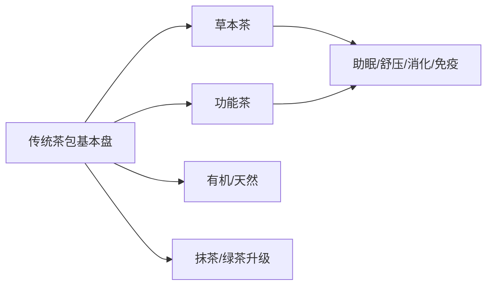

# 袋泡茶市场体量分析：美国 & 加拿大，近三年

> 调研对象：袋泡茶 / tea bags / bagged tea  
> 地区：美国、加拿大  
> 时间：近三年，优先 2022-2024，部分趋势延伸至 2025  
> 口径：可冲泡茶包，包含红茶、绿茶、草本/花草茶、果味茶、功能茶等；不包含即饮茶 RTD tea，也不把散装茶 loose-leaf tea 直接等同为袋泡茶。  
> 说明：你提到目前只能调研一个板块，因此本次仅覆盖**市场体量分析**，不包含关键词及流量结构分析。

---

## 1. 核心结论

| 结论 | 美国 | 加拿大 |
|---|---|---|
| 可验证市场上限口径 | 2024 年热茶市场约 **30.3 亿美元** | 2024 年 hot tea 市场约 **15.0 亿加元** |
| 更接近袋泡茶的公开口径 | 2024 年 loose / bagged tea 零售约 **14.0 亿美元** | 缺少公开的 tea bags 单独金额 |
| 近三年趋势 | 热茶市场 2022-2024 CAGR 约 **2.8%**，温和增长 | 2019-2024 hot tea CAGR 约 **8.2%**，增长较快 |
| 主要增长方向 | 草本茶、功能茶、有机绿茶、抹茶、wellness blends | Fruit / herbal tea 是最大细分，占 2024 年 hot tea 约 **52.4%** |
| 品牌格局 | Bigelow、Lipton、Celestial、自有品牌、Twinings 领先 | Tetley 第一，但仅约 **9.3%**，市场高度分散 |
| 数据完整度 | 美国有较好的热茶和 loose / bagged tea 数据，但纯 tea bags 连续数据不足 | 加拿大 hot tea 和品牌份额数据较清晰，但 tea bags 单独数据不足 |

---

## 2. 美国市场规模与增长趋势

### 2.1 热茶市场规模

美国热茶市场近三年保持温和增长。

| 年份 | 美国热茶市场规模 | 同比增长 |
|---:|---:|---:|
| 2022 | 28.70 亿美元 | - |
| 2023 | 29.55 亿美元 | +3.0% |
| 2024 | 30.30 亿美元 | +2.5% |

按 2022-2024 年计算，美国热茶市场 CAGR 约为：

$$
CAGR = \left(\frac{30.30}{28.70}\right)^{1/2} - 1 \approx 2.8\%
$$

数据来源显示，美国热茶整体不是高速爆发市场，而是一个较成熟、稳定增长的消费品类。([Ken Research][ken-us-tea])

---

### 2.2 更接近袋泡茶的市场口径

公开数据中，美国较接近袋泡茶的口径是 **loose / bagged tea** 合并零售口径。

| 口径 | 年份 | 市场规模 | 增长 |
|---|---:|---:|---|
| 美国 loose / bagged tea 零售 | 2024，52 周截至 5 月 19 日 | 约 14.0 亿美元 | +1.5% |

该数据来自 Beverage Industry 引用 Circana 的零售扫描数据。需要注意，它是 **loose tea + bagged tea 合并口径**，并非纯 tea bags。([Beverage Industry / Circana][bev-circana])

因此，对美国袋泡茶市场可以这样理解：

- **TAM 上限参考**：美国热茶市场，2024 年约 **30.3 亿美元**。
- **SAM 更接近口径**：美国 loose / bagged tea 零售，2024 年约 **14.0 亿美元**。
- **纯 tea bags 精确规模**：公开数据不足，不能可靠给出连续三年金额。

---

### 2.3 美国袋泡茶在整体茶市场中的地位

美国袋泡茶仍是热茶消费中的重要形态，原因包括：

1. **便利性强**：单包冲泡、易携带、易标准化。
2. **渠道适配度高**：适合商超、会员店、便利零售、电商和办公场景。
3. **功能茶和草本茶多以茶包形态销售**：例如助眠、消化、免疫、舒缓压力、女性健康等 wellness tea。
4. **价格带覆盖广**：从大众红茶、绿茶，到有机、功能性、高端草本混合茶。

不过，袋泡茶与以下品类应明确区分：

| 品类 | 是否纳入本报告袋泡茶口径 | 说明 |
|---|---|---|
| 传统茶包 | 是 | 红茶、绿茶、乌龙等袋泡形式 |
| 草本/花草茶包 | 是 | Chamomile、peppermint、rooibos、hibiscus 等 |
| 功能茶包 | 是 | Sleep、detox、digestion、stress relief 等 |
| 散装茶 loose-leaf | 否，除非数据与 bagged tea 合并 | 公开数据常与袋泡茶合并 |
| 即饮茶 RTD tea | 否 | 属冷饮/即饮饮料市场 |

---

## 3. 加拿大市场规模与增长趋势

### 3.1 Hot tea 市场规模

加拿大公开数据多采用 **hot tea / caffeinated hot tea** 口径，而非 tea bags 单独口径。

| 口径 | 年份 | 市场规模 | 增长 |
|---|---:|---:|---|
| 加拿大 caffeinated hot tea | 2024 | 约 15.0 亿加元 | 2019-2024 CAGR +8.2% |
| 加拿大 hot drinks | 2024 | 约 45.0 亿加元 | 2019-2024 CAGR +8.3% |
| 加拿大 RTD cold tea | 2024 | 约 14.0 亿加元 | 2019-2024 CAGR +10.9% |

这里的 RTD cold tea 属于即饮茶，不纳入袋泡茶口径，但它说明加拿大茶饮消费整体具有较强增长动能。([Agriculture and Agri-Food Canada][aa-fc-canada])

---

### 3.2 加拿大袋泡茶口径的限制

加拿大公开资料中，tea bags 被描述为重要包装形态，但缺少单独的 tea bags 市场金额。

因此，加拿大市场可以这样判断：

- **TAM 上限参考**：2024 年 hot tea 市场约 **15.0 亿加元**。
- **SAM 袋泡茶市场**：公开数据不足，无法可靠拆分。
- **SOM 品牌可获得份额**：可以参考 hot tea 品牌份额，但不能直接视为 tea bags 份额。

---

## 4. 细分品类结构

## 4.1 美国：草本、功能、有机和绿茶相关增长更明显

美国袋泡茶相关增长方向主要集中在：

- Herbal tea / 草本茶
- Functional tea / wellness tea
- Organic green tea / 有机绿茶
- Matcha green tea / 抹茶绿茶
- Green tea with herbs / 绿茶草本混合
- Rooibos / 路易波士
- Black & herbal blends / 红茶草本混合
- Red tea / herbal red tea

Beverage Industry 引用 Circana 的观点显示，草本茶是 tea bags 中最大的子类之一。([Beverage Industry / Circana][bev-circana])

这意味着美国市场的机会不只是传统红茶或绿茶，而是更偏向：

---

## 4.2 加拿大：Fruit / herbal tea 已成为最大细分

加拿大 hot tea 细分结构中，fruit / herbal tea 是最大品类。

| 细分品类 | 2024 年市场规模 | 占比 |
|---|---:|---:|
| Fruit / herbal tea | 7.655 亿加元 | 52.4% |
| Black tea | 3.181 亿加元 | 21.8% |
| Green tea | 2.936 亿加元 | 20.1% |
| Other caffeinated tea mixes | 0.844 亿加元 | 5.8% |

Fruit / herbal hot tea 在 2019-2024 年 CAGR 达 **9.9%**，高于整体 hot tea 增速。([Agriculture and Agri-Food Canada][aa-fc-canada])

这对袋泡茶尤其重要，因为 fruit / herbal tea 通常高度依赖茶包形态销售。换句话说，加拿大袋泡茶机会很可能集中在：

- 花果茶
- 草本茶
- 无咖啡因茶
- 晚间/助眠场景
- 健康生活方式茶
- 天然、有机、可持续包装茶包

---

## 5. 品牌竞争格局

## 5.1 美国主要品牌

美国 loose / bagged tea 市场中，公开资料显示主要品牌包括：

| 排名/位置 | 品牌 | 说明 |
|---|---|---|
| 1 | Bigelow | 美国袋泡/盒装茶强势品牌 |
| 2 | Lipton | 大众茶包代表品牌 |
| 3 | Celestial | 草本茶和花草茶强势 |
| 4 | Private label | 零售商自有品牌 |
| 5 | Twinings | 英式茶和传统茶类强势 |

其他在草本、功能、高端茶包中活跃的品牌包括：

- Traditional Medicinals
- Yogi
- Tazo
- Stash
- Harney & Sons

美国市场目前公开资料可确认头部品牌排序，但未披露这些品牌在纯 tea bags 中的具体份额。([Beverage Industry / Circana][bev-circana])

---

## 5.2 加拿大主要品牌

加拿大 hot tea 市场品牌份额较清晰，但注意这是 hot tea 口径，不是 tea bags 单独口径。

| 品牌/企业 | 2024 年零售销售额 | 市占率 |
|---|---:|---:|
| Tetley / Tata Consumer Products | 1.353 亿加元 | 9.3% |
| Lipton / Red Rose / Salada / Pure Leaf | 0.904 亿加元 | 6.2% |
| DAVIDsTEA | 0.778 亿加元 | 5.3% |
| Celestial Seasonings / Hain Celestial | 0.451 亿加元 | 3.1% |
| Steeped Tea | 0.334 亿加元 | 2.3% |
| Twinings / Associated British Foods | 0.214 亿加元 | 1.5% |
| Private label | 0.548 亿加元 | 3.7% |
| Others | 9.784 亿加元 | 66.9% |

加拿大市场的关键特征是：**高度分散**。

即使是第一名 Tetley，份额也只有 9.3%；Others 占 66.9%，说明市场中有大量中小品牌、区域品牌、天然食品品牌、进口品牌和专业茶品牌。([Agriculture and Agri-Food Canada][aa-fc-canada])

---

## 6. 渠道与价格带变化

### 6.1 渠道结构

两国均缺少公开、可靠的 tea bags 渠道份额数据，但可以确认的方向包括：

| 市场 | 渠道观察 |
|---|---|
| 美国 | 商超/大卖场仍是主渠道，天然食品店、电商、Amazon、DTC 在草本和功能茶中更重要 |
| 加拿大 | 商超、药房、天然食品渠道、电商和专业茶零售共同构成 hot tea 销售渠道 |
| 两国共同点 | 便利性、单份化、线上补货、订阅制和组合装推动袋泡茶消费 |

The Insight Partners 等资料显示，草本茶在超市/大卖场渠道基础较强，同时线上渠道增长较快。([The Insight Partners][insight-herbal])

---

### 6.2 价格带变化

袋泡茶市场正在从单一大众价格带，向多层价格带发展。

| 价格带 | 产品特征 | 代表机会 |
|---|---|---|
| 大众基础型 | 红茶、绿茶、早餐茶、日常饮用 | Lipton、Tetley、自有品牌 |
| 中端天然型 | 草本茶、花果茶、有机茶 | Celestial、Tazo、Stash |
| 功能型 | 助眠、消化、舒压、免疫、detox | Yogi、Traditional Medicinals |
| 高端/礼品型 | 高品质原料、可持续包装、混合风味 | Twinings 高端线、DAVIDsTEA、Harney & Sons |
| 专业健康型 | Adaptogen、无咖啡因、低糖生活方式 | Wellness blends、新兴 DTC 品牌 |

美国和加拿大的共同趋势是：传统红茶、绿茶仍是基础盘，但增长亮点更偏向 **功能化、高端化、有机化和草本化**。

---

## 7. TAM / SAM / SOM 判断

## 7.1 美国

| 层级 | 建议口径 | 可用数据 | 判断 |
|---|---|---:|---|
| TAM | 全部热茶市场 | 2024 年约 30.3 亿美元 | 可作为市场上限 |
| SAM | Loose / bagged tea 零售 | 2024 年约 14.0 亿美元 | 更接近袋泡茶机会 |
| SOM | 单一品牌可获得份额 | 公开数据不足 | 不能可靠估算 |

美国纯 tea bags 的连续市场规模和品牌份额公开不足，因此不建议直接给出精确 SOM。

---

## 7.2 加拿大

| 层级 | 建议口径 | 可用数据 | 判断 |
|---|---|---:|---|
| TAM | Hot tea 市场 | 2024 年约 15.0 亿加元 | 可作为上限 |
| SAM | Hot tea 中 tea bags | 无公开金额 | 当前无法可靠估算 |
| SOM | 品牌可获得份额 | 有 hot tea 品牌份额，但非 tea bags 份额 | 只能作为参考 |

加拿大 hot tea 市场中 fruit / herbal tea 占比过半，因此如果目标产品是草本、花果、功能袋泡茶，实际 SAM 可能主要集中在这一部分，但目前仍缺少 tea bags 单独拆分数据。

---

## 8. 机会判断

### 8.1 美国机会

美国袋泡茶市场是成熟市场，机会不在于整体高速增长，而在于结构性升级。

值得关注的机会包括：

1. **草本茶和功能茶**
   - 助眠、舒压、消化、免疫等场景明确。
   - 消费者愿意为功能诉求和天然成分支付溢价。

2. **有机和 clean label**
   - 有机绿茶、有机草本茶、无添加、非转基因等概念有增长空间。

3. **高端便利化**
   - 高品质茶叶 + 便利茶包形式。
   - 金字塔茶包、可降解茶包、无塑茶包可提升溢价。

4. **线上和订阅渠道**
   - Amazon、DTC、组合装、功能场景套装适合新品牌切入。

---

### 8.2 加拿大机会

加拿大市场虽然规模小于美国，但 hot tea 增速较快，且 fruit / herbal tea 占比高。

主要机会包括：

1. **Fruit / herbal tea**
   - 2024 年占 hot tea 约 52.4%。
   - 是加拿大最核心的袋泡茶关联品类。

2. **无咖啡因和健康生活方式茶**
   - 加拿大消费者对 wellness、天然、有机和可持续产品接受度较高。

3. **差异化品牌进入空间**
   - 市场高度分散，头部品牌份额不高。
   - 新品牌可通过风味、功能、包装和渠道差异化进入。

4. **可持续包装**
   - 可降解茶包、无塑茶包、环保纸盒等可能成为溢价点。

---

## 9. 总结

美国和加拿大袋泡茶市场均不是单纯依靠传统红茶增长的市场，而是明显向 **草本化、功能化、有机化、高端化和便利化** 迁移。

- **美国**：2024 年热茶市场约 **30.3 亿美元**，loose / bagged tea 约 **14.0 亿美元**。市场成熟，增长温和，但功能茶、草本茶和高端茶包有结构性机会。
- **加拿大**：2024 年 hot tea 市场约 **15.0 亿加元**，fruit / herbal tea 占比约 **52.4%**，市场高度分散，草本/花果/健康茶包机会更突出。
- 两国共同限制是：公开数据中缺少连续三年的 **纯 tea bags** 市场金额和品牌份额，因此更适合使用 hot tea、loose / bagged tea、fruit / herbal tea 等相关口径进行判断。

[ken-us-tea]: https://www.kenresearch.com/industry-reports/usa-tea-market "Ken Research - USA Tea Market"
[bev-circana]: https://www.bevindustry.com/articles/96746-2024-state-of-the-industry-tea-market-remains-hot-among-consumers "Beverage Industry / Circana - Tea Market"
[aa-fc-canada]: https://agriculture.canada.ca/en/international-trade/reports-and-guides/customized-report-service-coffee-and-tea-caffeine-free-hotcold-drinks-canada "Agriculture and Agri-Food Canada - Coffee and Tea Market"
[insight-herbal]: https://www.theinsightpartners.com/reports/herbal-tea-market "The Insight Partners - Herbal Tea Market"
[market-us-tea]: https://market.us/report/tea-market "Market.us - Tea Market"
[factmr-teabags]: https://www.factmr.com/report/tea-bags-market "Fact.MR - Tea Bags Market"
[spherical-canada]: https://www.sphericalinsights.com/reports/canada-tea-and-herbal-tea-market "Spherical Insights - Canada Tea and Herbal Tea Market"
